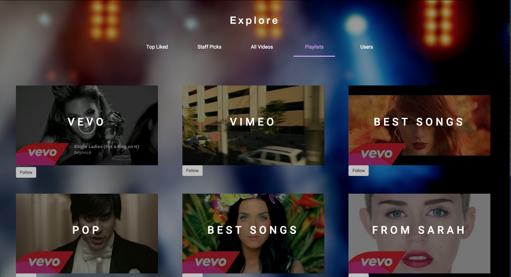

# Music Video Collector App

Direct link: [music-video-collector.com](http://www.music-video-collector.com)  
Heroku link: [music-video-collector.herokuapp.com](http://music-video-collector.herokuapp.com)  

## App Description & Features
Music Collector is an app built on Rails and Backbone.  
Primary focus of the site is displaying music videos embedded from Youtube, Vimeo, and Vevo (via user-submitted URLs).

The site:
- embeds videos in a clean interface  
- fetches thumbnails from the video's source
- displays a pictorial index of available videos
- uses custom Rails routes with a filter variable to create several unique feeds of videos for the user
- allows users to create playlists and like videos
- allows users to follow other users or playlists (using a polymorphic association)
- shows a user page with side-scrolling playlists and posts

Feed View  

Playlists View  

Users View  

### Site Features List:
- [x] Watch videos
- [x] Like videos
- [x] Create playlists
- [x] Create videos (by entering links) ('posts')
- [x] View a collection of all your liked videos
- [x] Follow other users or playlists
- [x] View a feed of posts from your followed users and playlists
- [x] Explore other user profiles
- [x] User profiles includes horizontal scrolling of their posts and playlists
- [x] Add and remove posts to playlists
- [x] Add-to-playlist form button on thumbnails and video show page
- [x] Guest sign-in
- [x] View top staff picks
- [x] Feed option: top liked videos (across entire site)
- [x] Site shows thumbnail index views of videos
- [x] Post thumbnails are fetched from the source
- [x] User and Playlist thumbnails are fetched from a video in the model's posts
- [x] Guest-account login

### Potential future features
- [ ] Advanced video views - cinema view (dark background)
- [ ] Index views have an alternate mode - render videos instead of thumbnails
    ability to play videos directly from index view
- [ ] Search for users/playlists/posts by any fields
- [ ] Button to watch next video in a playlist/view from the video show page
- [ ] FriendlyID for user (and post/playlist) names
- [ ] Kaminari scrolling
- [ ] Nested comments for videos

### Implementation Timeline

Phase 1: User Authentication, Blog Creation (~1 day)  
Phase 2: Viewing Channels and Posts (~1 days)  
Phase 3: Youtube API + Vimeo API (~2 days)  
Phase 4: Feeds, Users (1 day)  
Phase 5: Liking Videos and Channels (~1 days)  
Phase 6: User Views (~2 days)  
Phase 7: Search and Explore (~2 days)  
Phase 8: Advanced Views (~2 days)  
